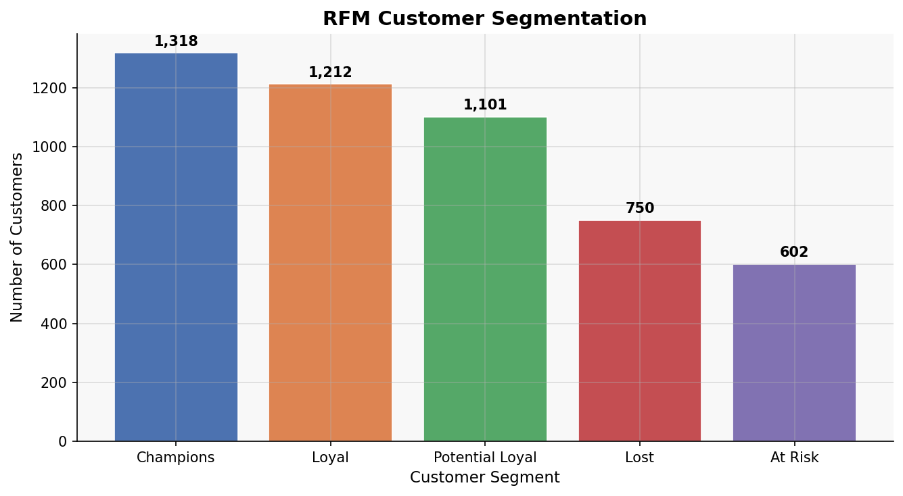
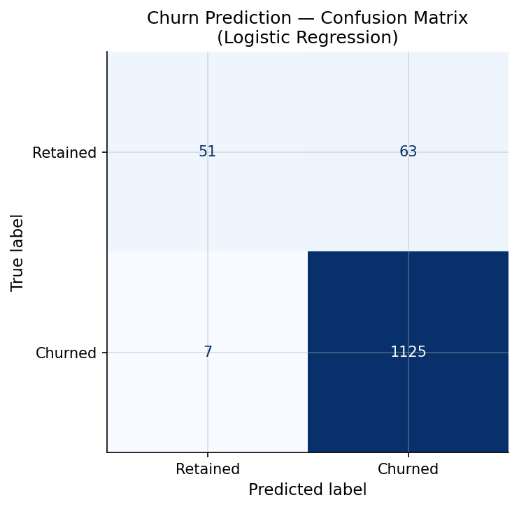
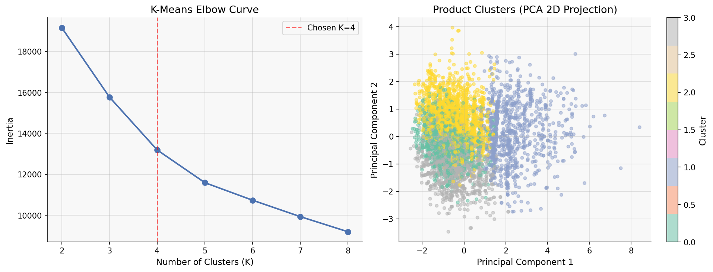
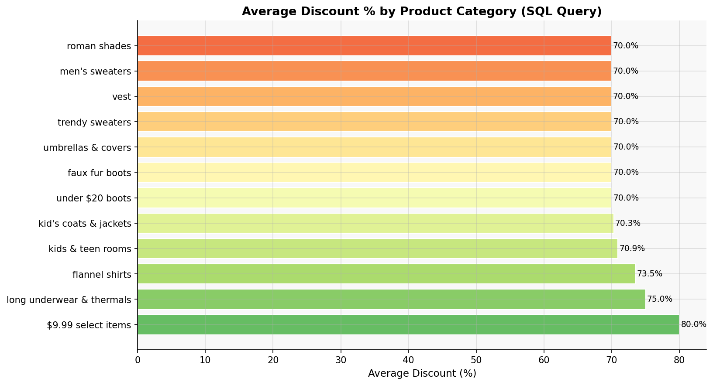
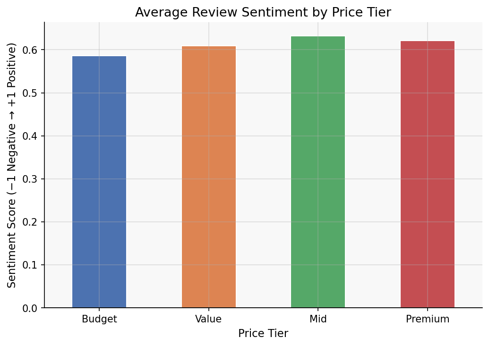

# 🛍️ JCPenney Customer Targeting Using Data Analytics & Machine Learning

A data analytics and machine learning project built to help JCPenney — one of America's largest retail chains — understand why customers are leaving, who their most valuable customers are, and what it would take to bring growth back.

---

## 🎯 The Problem

JCPenney built its reputation as a dominant American clothing brand — over 2,000 stores, 650+ unique brands, and a presence across all 57 US states. Then it started losing.

Changing CEOs broke customer trust. Delayed adoption of e-commerce let competitors like H&M and Zara capture the mid-market. Younger shoppers stopped coming through the door entirely — and the data shows it.

**The challenge: what does the data actually tell us — and what should JCPenney do about it?**

This project analyses over 27,000 customer reviews, 7,900+ products, and 5,000 registered users to answer that question — and builds predictive models to identify at-risk customers before they're fully lost.

---

## 📊 Dataset

- **39,063** customer reviews across JCPenney's product catalogue
- **7,982** products spanning 1,058 categories and 661 unique brands
- **5,000** registered users with demographic and location data
- Features include: product price, review scores, customer age, US state, brand, category, list vs sale price

Target variable for churn model: customers with an average review score below 3.0 — a proxy for dissatisfied users likely to disengage

---

## What I Actually Did

### Data Quality

Before building anything, every dataset was audited for quality issues. The findings:

- **No duplicates** across any of the six files — clean uniqueness throughout
- **Null values in price columns** — filled using the median to preserve the distribution without distortion
- **Rows with null SKU values removed** — a product without a key identifier is meaningless for analysis
- **Negative prices and unrealistically high outliers removed** — prices capped at $200 to reflect the real retail range
- **Review scores of zero removed** — a score of 0 carries no signal and would corrupt averages

Small decisions, but the kind that silently corrupt downstream analysis if left unchecked.

### SQL Engine

All five datasets were loaded into an in-memory **SQLite database** and queried using structured SQL — the same approach used in production data pipelines. This allowed multi-table JOIN operations, CASE-based price tier logic, and aggregated insights across reviews, users, and products simultaneously.

```sql
-- Price vs satisfaction: does spending more get you better scores?
SELECT p.Price, r.Score
FROM   products p
JOIN   reviews  r ON p.Uniq_id = r.Uniq_id
WHERE  p.Price IS NOT NULL AND r.Score IS NOT NULL
```

Result: Pearson r = **−0.009** (p = 0.131). Price has essentially zero relationship with customer satisfaction.

### Feature Engineering

Key variables engineered from the raw data:

- **Age** — derived from date of birth for all 5,000 users, then grouped into six demographic bands
- **Discount %** — calculated as `(list_price − sale_price) / list_price × 100` for every product
- **Price tiers** — Budget / Value / Mid / Premium using SQL CASE logic
- **RFM scores** — Recency, Frequency, and Monetary quintile scores per customer

### RFM Customer Segmentation

Every customer was scored across three dimensions and placed into one of five segments — the same framework used by retailers and banks to decide where to focus retention spend.

```
Champions       1,318  — Highest value, most engaged. VIP loyalty targets.
Loyal           1,212  — Consistent reviewers. Retention priority.
Potential Loyal 1,101  — Showing promise. Upsell opportunity.
Lost              750  — Disengaged. Reactivation campaigns needed.
At Risk           602  — Declining engagement. Urgent win-back required.
```

### K-Means Product Clustering

K-Means clustering (K=4, selected via elbow method) grouped JCPenney's product catalogue into four distinct tiers based on price, discount level, rating, and review volume. PCA reduced the five features to two dimensions for visualisation — capturing **60.1% of total variance**.

The clusters reveal a clear split: a large mid-range mainstream segment, a value everyday-items cluster, a premium segment, and a clearance/outlier group where sale prices actually exceed list prices — a data anomaly worth flagging to the business.

### Churn Prediction — Logistic Regression

A logistic regression model was trained to identify customers likely to churn — defined as those whose average review score falls below 3.0, indicating persistent dissatisfaction.

**Train / Test split:** 75% / 25% with stratified sampling to preserve the class ratio.

```
              precision    recall  f1-score   support

  Retained       0.88      0.45      0.59       114
   Churned       0.95      0.99      0.97     1,132

  Accuracy                           94.4%    1,246
```

**What this means in practice:**

The model correctly identifies **1,125 out of 1,132 churned customers** — people who are already dissatisfied and likely to disengage. With this list, JCPenney's CRM team can reach out with targeted offers *before* those customers stop buying entirely.

### Sentiment Analysis

Each of the 27,798 reviews was scored for sentiment polarity using a keyword-based approach — matching against lists of positive and negative retail-relevant terms.

Result: sentiment is broadly positive across all price tiers (all above 0.58), but **Budget-tier products show the lowest sentiment** — suggesting customers feel the quality-for-price trade-off isn't working at the low end. Fixing this is simpler than launching new product lines.

### Multi-Agent AI Pipeline

The analysis pipeline was structured as a series of specialised agents, each handling a distinct part of the workflow:

```
SQL Agent       → queries, joins, price tiers, correlation testing
EDA Agent       → distributions, RFM scoring, demographic breakdowns
Modelling Agent → K-Means clustering, churn prediction, PCA
Critic Agent    → validates outputs, checks for methodological issues
Synthesis Agent → translates findings into business recommendations
```

Each agent passes its outputs to the next — the Critic Agent checks for issues before Synthesis writes the final recommendations. In a production deployment, each of these would be a separate LLM API call with a specialised system prompt.

---

## 📊 Key Visualisations

### Customer Segmentation (RFM)


### Churn Prediction Performance


### Product Clustering (K-Means + PCA)


### Discount Strategy Insights


### Sentiment Analysis by Price Tier


---

## Key Findings

**Price does not drive customer satisfaction.** The Pearson correlation between product price and review score is r = −0.009 — statistically insignificant. Customers rate cheap products and expensive products roughly the same. Quality, fit, and fabric are the real satisfaction levers.

**The customer base is ageing — and the gap at the bottom is alarming.** Average customer age is 50.8 years. The under-25 segment has fewer than 160 reviewers compared to 900–1,000+ in every older age group. JCPenney is functionally invisible to younger shoppers.

**1,318 Champion customers are being left without a loyalty structure.** These are the highest-value, most engaged customers in the dataset — and there is no evidence of a programme designed to retain them.

**602 customers are at risk right now.** The churn model has identified them. Without intervention, they are on their way out.

**The Mid ($50–$99) tier dominates the catalogue** with 4,497 products, but Budget-tier sentiment is the weakest. The business is underinvesting in quality at the entry level — which is also where it needs to attract younger customers.

**Average discount across all products is 41.7%.** Some categories exceed 80%. That margin is being left on the table without a clear strategic rationale.

---

## The Real Business Impact

Without any model, a CRM team sending win-back communications to all 4,983 customers would be working blind — contacting loyal Champions and disengaged Lost customers with the same message.

With RFM segmentation and the churn model combined, communications can be split into four targeted lanes:

| Lane | Customers | Action | Expected Outcome |
|------|-----------|--------|-----------------|
| Champions | 1,318 | VIP loyalty invite | Increased retention and spend |
| Loyal + Potential Loyal | 2,313 | Personalised recommendations | Upsell conversion |
| At Risk | 602 | Targeted discount — immediate | Win-back before full churn |
| Lost | 750 | Reactivation email series | Partial recovery |

That is a fundamentally different use of marketing spend — effort directed where it actually converts.

---

## Recommendations

**1. Launch a win-back campaign for the 602 At-Risk customers within 30 days.** The churn model has identified them. A personalised discount or loyalty offer sent now costs a fraction of acquiring a replacement customer.

**2. Build a VIP programme for Champions.** 1,318 customers are already the best advocates. Early access to new ranges, exclusive discounts, and personalised communication would cost very little and retain disproportionate value.

**3. Invest in youth product lines.** The under-25 segment is not just underperforming — it is almost absent from the data. Without a deliberate strategy to attract younger shoppers, the customer base will continue to age out.

**4. Fix quality at the Budget tier, not the price.** Sentiment is weakest for the cheapest products. The answer is not to raise prices — it is to close the gap between what customers expect and what arrives. Better fabric sourcing and quality control at the entry level would move the needle faster than any marketing campaign.

**5. Rationalise the discount strategy.** An average discount of 41.7% across the full catalogue signals that discounting has become structural rather than strategic. Targeted discounts for At-Risk and Lost segments would be more effective and more profitable than blanket price reductions.

**6. Use the data to make decisions.** The correlation analysis shows that JCPenney's pricing decisions have had no measurable effect on customer satisfaction. Strategy needs to shift toward quality, range diversity, and customer experience — areas where the data shows actual variation in outcomes.

---

## 📓 View the Full Analysis

Click [`Full Analysis Notebook`](https://github.com/Imran3285/jcpenney-analytics/blob/main/3457775_BD2_Advanced.ipynb) to view the complete notebook with all SQL queries, model outputs, figures, and multi-agent commentary rendered inline — no setup required.

---

## Project Structure

```
jcpenney-customer-targeting/
├── 3457775_BD2_Advanced.ipynb          # Full analysis notebook
├── jcpenney_advanced_analysis.py       # Standalone Python script
├── data/
│   ├── products.csv
│   ├── reviews.csv
│   ├── users.csv
│   ├── jcpenney_products.json
│   └── jcpenney_reviewers.json
├── figures/
│   ├── fig1_clustering.png
│   ├── fig2_rfm_segments.png
│   ├── fig3_churn_confusion.png
│   ├── fig4_discount_by_category.png
│   ├── fig5_state_scores.png
│   ├── fig6_sentiment_by_tier.png
│   ├── fig7_cluster_profiles.png
│   └── fig8_price_vs_score.png
└── README.md
```

---

## Reproducing the Results

```bash
git clone https://github.com/Imran3285/jcpenney-analytics.git
cd jcpenney-analytics
pip install pandas numpy matplotlib scikit-learn scipy
jupyter notebook "3457775_BD2_Advanced.ipynb"
```

Run all cells top to bottom. Random seed is fixed at 42 — results are fully reproducible.

---

## Stack

Python · Pandas · NumPy · SQLite · scikit-learn · SciPy · Matplotlib · Jupyter Notebook

---

## Author

Muhammad Imran  
MSc Data Science for Business — University of Stirling
